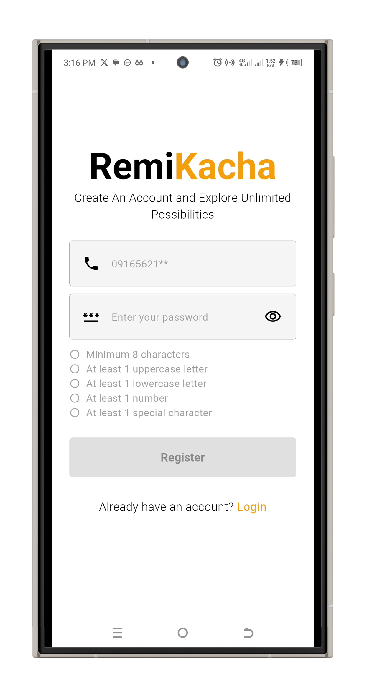

# Remi Kacha Money App

A modern Flutter application for sending money, managing wallets, viewing transactions, and handling currency exchange — built with Riverpod for state management and Sqflite for local persistence.

---


## 🛠️ Getting Started

### Prerequisites
- Flutter SDK 3.x+
- Android Studio or VS Code
- Device or emulator


## 📱 App Screenshots

|  |  |
|:-----------------------------------:|:---------------------------:|
| **Onboarding Screen**               | **Login Screen**           |

|  |  |
|:---------------------------:|:------------------------:|
| **Signup Screen**           | **Home Screen**          |

|  |  |
|:------------------------:|:--------------------------------------:|
| **Send Money**           | **Send Confirmation**                  |

|  |  |
|:------------------------:|:------------------------------:|
| **App Lock Screen**      | **User Profile**               |

|  |
|:-----------------------:|
| **Extras / Example**    |


### Clone the repo
```bash
git clone https://github.com/yourusername/send_money_app.git
cd send_money_app

[🎬  Demo Onboarding  Video](https://drive.google.com/file/d/1mC2W1qDDq_cx8CSiRI4mgZBFshY0jkup/view)
[🎬  Demo Exchange And Transactions  Video](https://drive.google.com/file/d/1m10iqcLskt2PODK3coH8M84eGTbq8a-8/view)


## 🚀 Features

- 🔐 User authentication (local only)
- 💳 Wallet system per currency
- 💰 Send money to recipients (bank/phone)
- 🔄 Real-time currency conversion
- 📈 Transaction history
- 🔒 Balance hide/show toggle
- 📉 Offline support via Sqflite


---

## 🧑‍💻 Tech Stack

| Category            | Stack                            |
|---------------------|----------------------------------|
| **Framework**       | [Flutter](https://flutter.dev)   |
| **State Management**| [Riverpod](https://riverpod.dev) |
| **Local DB**        | Encripted Sqflite                |
| **UI Toolkit**      | Custom widgets + Material 3      |
| **Form Validation** | `TextFormField`, custom          |
| **Currency Handling** | Internal conversion logic        |

---

## 📦 Packages Used

- `flutter_riverpod`
- `sqflite`
- `path_provider`
- `intl`
- `equatable` *(for model equality)*


---

## 🏗️ Architecture

- **Feature-First Modular Structure**
    - `/features/auth/`
    - `/features/wallet/`
    - `/features/transactions/`
    - `/core/` (shared utils, theme, db)
- Uses `AsyncNotifierProvider.family` for side-effect-driven operations.
- `PopScope` and `ref.listen` to handle loading and navigation block during async ops.

---

# Why AsyncNotifierProvider for Money Transfers?

The `transactionProvider` uses `AsyncNotifierProvider.family` instead of `FutureProvider` for handling money transfers due to the following reasons:

## Complex State Management

Money transfers involve multiple asynchronous operations (e.g., fetching wallet balance, sending money, updating transaction history) and require maintaining a complex state (`TransactionState` with `walletBalance` and `transactions`). 

`AsyncNotifierProvider` supports this through its `AsyncNotifier` base class, which allows for custom state management logic, including updating state in response to user actions like `sendMoney`. 

In contrast, `FutureProvider` is designed for single, one-off asynchronous operations (e.g., fetching data once) and cannot manage ongoing state changes or user interactions.

## User-Specific Data with Family Modifier

The app manages transactions per user, parameterized by `UserModel`. 

`AsyncNotifierProvider.family` supports this through `FamilyAsyncNotifier`, which allows the `TransactionNotifier` to access the `UserModel` via the `arg` property and tailor the state (e.g., `walletBalance`, `transactions`) to the specific user. 

`FutureProvider.family` can handle parameterized data but lacks the flexibility to manage dynamic state updates or side effects.

## Side Effects with `ref.listen`

The `TransactionNotifier` uses `ref.listen` to reset state on logout (via `authProvider`) and `ref.watch` to check exchange rates (via `exchangeRateProvider`). 

`AsyncNotifierProvider` supports these interactions within the notifier, enabling reactive state updates and side effects. 

`FutureProvider` does not provide a mechanism for such dynamic interactions, as it only resolves a single future.

## State Transitions and UI Feedback

Money transfers require handling loading, data, and error states (using `AsyncValue`) to provide feedback in the UI (e.g., showing a loading indicator or error message). 

`AsyncNotifierProvider` allows the `TransactionNotifier` to set `state = AsyncValue.loading()` or `AsyncValue.error(e, stackTrace)` during operations, which the `MoneyTransferScreen` can react to using `ref.watch`. 

`FutureProvider` also supports `AsyncValue` but is less suited for managing multiple state transitions triggered by user actions.

## Reusability and Extensibility

`AsyncNotifierProvider` allows the `TransactionNotifier` to encapsulate all transaction-related logic (e.g., `sendMoney`, state updates) in a reusable class. 

This makes it easier to extend the app with new features (e.g., transaction cancellation) compared to `FutureProvider`, which would require separate providers for each operation.

---

**In summary**, `AsyncNotifierProvider.family` was chosen for `transactionProvider` to handle the dynamic, user-specific, and interactive nature of money transfers, providing a robust solution for state management, side effects, and UI integration compared to the more limited `FutureProvider`.

